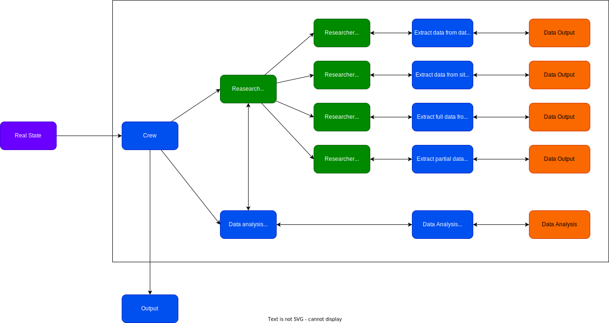

# Data extraction

## How to

- To better view, press "Period key"(`.`)

## Study List

- WebScraping
  - Tutorials
    - Videos
      - [ ] [webscraping com python - 5000 itens OLX com scrapy e python em 5 minutos.](https://www.youtube.com/watch?v=dKAKVVciU5M)
- AI
  - Articles
    - [ ] [AI Property Valuation Software: A New Disruption of Real Estate Appraisals?](https://ascendixtech.com/ai-property-valuation-tools-appraisal/)
    - [ ] [API para previsão de preços de apartamentos na cidade de São Paulo](https://pt.linkedin.com/pulse/api-para-previs%C3%A3o-de-pre%C3%A7os-apartamentos-na-cidade-s%C3%A3o-silva)
  - Tutorials
    - Videos
      - [ ] [Build universal web scraping agent](https://www.youtube.com/watch?v=dSX5eoD4-u4)
      - [ ] [Staying Undetected and Unblocked - Scrapy Tutorial Series Part#11](https://www.youtube.com/watch?v=sGTrqQECZ2E)
- Tools
  - [undetected_chromedriver](https://github.com/ultrafunkamsterdam/undetected-chromedriver)
  - [ ] [NODRIVER](https://github.com/ultrafunkamsterdam/nodriver)

## References

- VSCode extensions
  - [Excel Viewer](https://marketplace.visualstudio.com/items?itemName=GrapeCity.gc-excelviewer)
  - [Draw.io Integration](https://marketplace.visualstudio.com/items?itemName=hediet.vscode-drawio)
    - [Tutorial](https://www.youtube.com/watch?v=RuvtgvJ2UXU)
  - Optional
    - [Excalidraw VSCode](https://marketplace.visualstudio.com/items?itemName=pomdtr.excalidraw-editor)
    - [Code Diagram](https://marketplace.visualstudio.com/items?itemName=CodeDiagram.codediagram)